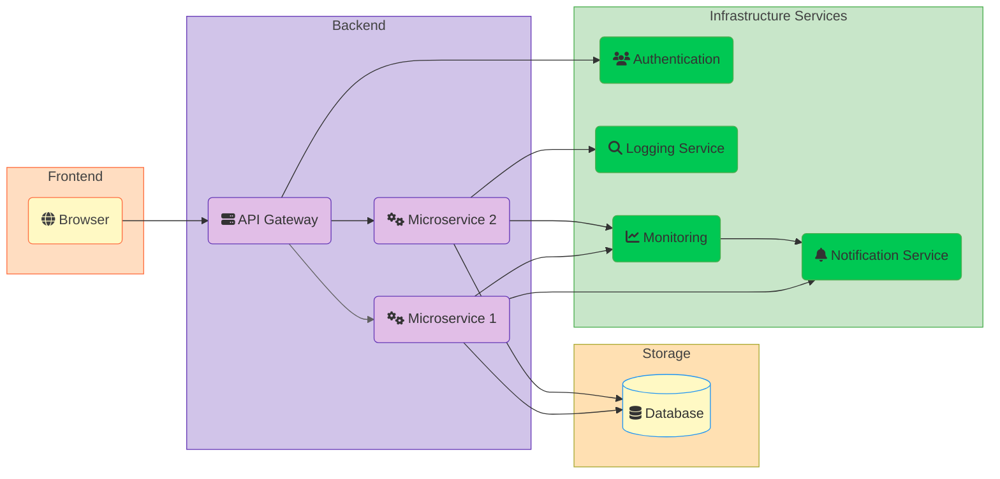

# Example Architecture diagram

```mermaid
flowchart LR
 subgraph Frontend["Frontend"]
        A("fa:fa-globe Browser")
  end
 subgraph Backend["Backend"]
        B1("fa:fa-server API Gateway")
        B2("fa:fa-cogs Microservice 1")
        B3("fa:fa-cogs Microservice 2")
  end
 subgraph Storage["Storage"]
        C[("fa:fa-database Database")]
  end
 subgraph AdditionalServices["Infrastructure Services"]
        D1("fa:fa-users Authentication")
        D2("fa:fa-bell Notification Service")
        D3("fa:fa-search Logging Service")
        D4("fa:fa-chart-line Monitoring")
  end
    A --> B1
    B1 --> B2 & B3 & D1
    B2 --> C & D2 & D4
    B3 --> C & D3 & D4
    D4 --> D2
    style A color:#424242, stroke:#FF7043,fill:#FFF9C4
    style B1 color:#333, stroke:#673AB7,fill:#E1BEE7
    style B2 color:#333, stroke:#673AB7,fill:#E1BEE7
    style B3 color:#333, stroke:#673AB7,fill:#E1BEE7
    style C color:#333, stroke:#2196F3,fill:#FFF9C4
    style D1 color:#333, stroke:#4CAF50,fill:#00C853
    style D2 color:#333, stroke:#4CAF50,fill:#00C853
    style D3 color:#333, stroke:#4CAF50,fill:#00C853
    style D4 color:#333, stroke:#4CAF50,fill:#00C853
    style Backend fill:#D1C4E9,stroke:#673AB7,stroke-width:1px,color:#424242
    style AdditionalServices fill:#C8E6C9,stroke:#4CAF50,stroke-width:1px,color:#424242
    style Frontend fill:#FFDDC1,stroke:#FF7043,stroke-width:1px,color:#424242
    style Storage fill:#FFE0B2,color:#424242
    linkStyle 1 stroke:#616161


```